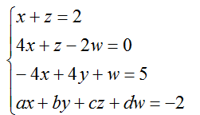

### Задание 1
При выполнении минимизировать использование циклов (for, while) и условного оператор if, вместо них следует использовать маски.  

Вставьте в ответ код программы с реализацией функции function(int_list), на вход которой подается список int_list из n (n>3) целых чисел . В function(int_list) последовательно:

* Создается numpy.ndarray (numpy массив) n_list из элементов int_list.

* В n_list все отрицательные элементы увеличиваются  на 3.

* В n_list  все положительные элементы увеличиваются в 2 раза.

* Отсортировать по возрастанию все элементы n_list.

Функция function(int_list) должна с помощью return возвращать сумму двух последних элементов n_list.

Для примера:
print(function([1,2,3,-3, 0]))          # 10
print(function([1,2,3,-3, 13, 0]))      # 32

### Задание 2
При выполнении минимизировать использование циклов (for, while) и условного оператор if, вместо них следует использовать маски.

Вставьте в ответ код программы с реализацией функции function(temperature1, temperature2), на вход которой подаются списки значений температуры, измеренной на двух метеостанциях в каждый из n (n>1) дней. В function() последовательно:

* Создать по numpy.ndarray (numpy массив) для каждого списка temperature1 и temperature2.

* В каждом из двух массивов оставить информацию только элементы с четными индексами, после чего объединить их в один массив. 

* В итоговом массиве найти максимальный и минимальный элемент, и среднее  арифметическое.
 

Функция function() должна с помощью return возвращать округленную c помощью int() до целого числа сумму значений максимального и минимального, среднего арифметического.

Для примера:
print(function([12,24,36],[12,24,36]))          # 72

print(function([12,24,36,44],[12,24,36,49]))    # 72

### Задание 3
При выполнении минимизировать использование циклов (for, while) и условного оператор if, вместо них следует использовать маски. Вставьте в ответ код программы с реализацией функции function(a, b, c, d), на вход которой подаются числовые коэффициенты a, b, c, d одного из уравнений системы линейных алгебраических уравнений (СЛАУ) с переменными x, y, z, w:

В function() решить СЛАУ (найти значения x, y, z, w удовлетворяющие системе), найти сумму найденных значений x, y, z, w и,  используя функцию int(), округлить ее до целого числа. С помощью return вернуть значение округленной суммы.

Для примера:
print(function(12,12,1,1))      # 2
print(function(102,12,33,1))          # 1